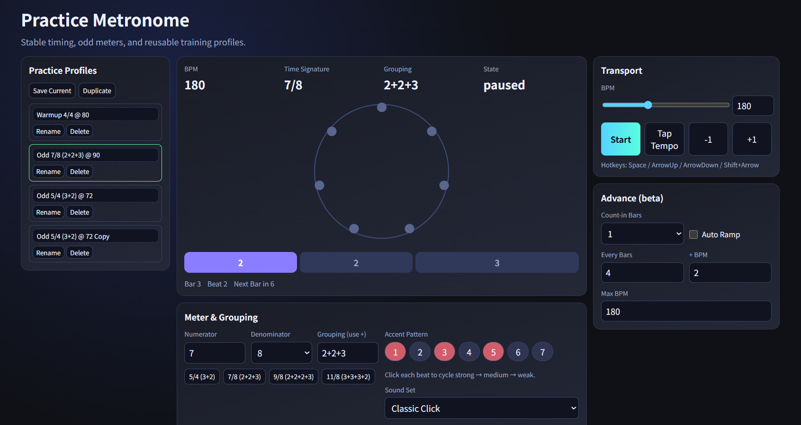

# Web Practice Metronome

音樂練習用的網頁節拍器

- 穩定 Web Audio 排程（lookahead scheduler）
- Odd meter（`5/4`, `7/8`, `9/8`, `11/8`）與 grouping 編輯
- Accent pattern（strong / medium / weak）
- Profile 儲存（localStorage）
- Count-in、Tap Tempo、Auto Ramp、快捷鍵
- 基本視覺化（拍點環、小節分組進度、Bar/Beat 計數）




## 使用方式

1. `Start` 開始 / 暫停播放
2. 用 `BPM` slider 或 number 直接改速度
3. 用 `Meter & Grouping` 設定拍號與分組（例如 `2+2+3`）
4. 用 `Practice Profiles` 儲存/套用練習場景
5. 需要循序加速時開啟 `Auto Ramp`


## 快捷鍵

- `Space`: Start / Pause
- `ArrowUp` / `ArrowDown`: BPM ±1
- `Shift + ArrowUp` / `Shift + ArrowDown`: BPM ±5

## Run with Docker

Start
```bash
docker pull piano80742/tj_metronome:latest
docker run -d --rm -p 8080:80 --name tj_metronome-local piano80742/tj_metronome:latest
```
Stop
```bash
docker stop tj_metronome-local
```
## 本地建置

於 clone 後的專案根目錄：

```bash
git clone ...
./build/start.sh
```

預設埠為 8080。可在 `./build/env.config` 修改 `PROD_PORT`

- [http://localhost:8080](http://localhost:8080)

<details>
<summary>本地等效指令（未使用 start.sh）</summary>

```bash
cd <project_path>/metronome/build
docker build -f Dockerfile -t tj_metronome:dev ..
source env.config
docker run --rm -p "${PROD_PORT}:80" --name tj_metronome-local tj_metronome:dev
```

</details>

停止本地容器：

```bash
cd <project_path>/metronome
./build/stop.sh
```

### 開發

```bash
cd <project_path>/metronome
python3 -m http.server 5173
```

- [http://localhost:5173](http://localhost:5173)
